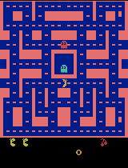
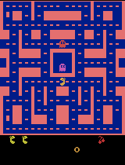
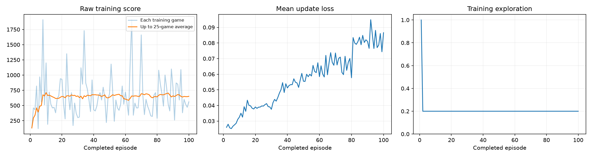

# Class 3: Training a DQN Agent to Play Ms. Pac-Man

This repository is my submission for the Class 3 assignment: train a Deep Q-Network (DQN) on
`ALE/MsPacman-v5` using the provided notebook, choosing three hyperparameters, and reporting what
the agent actually learned.

- Executed notebook: [pacman_dqn.ipynb](pacman_dqn.ipynb) (run in order, outputs saved, final-run version)
- Evidence: [results/](results/) (copied out of the gitignored `pacman_runs/` folder — see [Where things are saved](#where-things-are-saved))

## Overview and how to run

The notebook builds a convolutional DQN that watches four stacked 84×84 grayscale game screens,
picks a joystick move, and learns from a replay buffer, a target network, and a Huber loss target.
No coding is required — you edit three values in Section 1 and choose **Run All**.

- **Google Colab:** open [pacman_dqn.ipynb in Colab](https://colab.research.google.com/github/pepealonso95/pacman-dqn/blob/main/pacman_dqn.ipynb), select a GPU under `Runtime → Change runtime type`, edit Section 1, then `Runtime → Run all`. Packages install automatically.
- **Local Jupyter/VS Code:** use a Python 3.11–3.13 kernel, `pip install -r requirements.txt`, keep [pacman_player.py](pacman_player.py) beside the notebook for the local popup player, edit Section 1, then **Run All**.

This submission was executed locally and headlessly (`jupyter nbconvert --execute`) on a Python 3.13
virtual environment, with `SHOW_POPUPS = False` in the preview-settings cell so the always-on-top Tk
player didn't try to open windows during an unattended run; the GIFs it would have shown are saved
and embedded below exactly the same either way.

## My three hyperparameters

| Setting | Value | Why I chose it |
|---|---|---|
| **Exploration** | `0.20` | Keeps 20% of post-warm-up training moves random. This is the notebook's own reference value and struck a reasonable balance in a quick 5-episode sanity run I did first — training stayed numerically stable, so I kept it rather than reduce exploration before I had any evidence the agent needed less randomness. |
| **Episodes** | `100` | The notebook's suggested starting point. At the throughput I measured on this machine (~150 decisions/second on Apple Silicon MPS), 100 episodes was ~10 minutes — enough to pass the 25-episode threshold four times over (so periodic GIFs/checkpoints actually get produced) and to accumulate ~14,700 learning updates, versus only 501 in a 5-episode check. |
| **Learning rate** | `0.0001` | The notebook's reference Adam learning rate, tuned to stay stable with the small (5,000-transition) replay buffer and batch size 32 used in this classroom-scale setup. I had no evidence from my sanity run that this needed changing. |

**Before training, I expected:** a small but real improvement in mean evaluation score, given only
100 episodes (~60k decisions) — nowhere near full DQN-paper scale, but enough for the agent to learn
basic behaviors like avoiding immediate ghost collisions and eating nearby pellets, which are the
kinds of local patterns four stacked frames of Ms. Pac-Man can support.

**What I observed:** mean evaluation score rose from 492.0 (untrained) to 692.0 (trained) — a ~41%
improvement — but the gain was **not uniform across seeds** (4 of 5 seeds improved; one got worse
than baseline). Training loss also *increased* through training rather than decreasing, while the
raw training score plateaued after roughly episode 10. See [Limitation and next experiment](#limitation-and-next-experiment).

## Actual training budget

| Metric | Value |
|---|---|
| Completed episodes | 100 / 100 requested |
| Total decisions (env steps after 4× frame-skip) | 59,925 |
| Learning updates | 14,732 |
| Elapsed time (training + periodic demo recording) | 610.3 s (~10.2 minutes) |
| Hardware | Apple Silicon, PyTorch MPS backend (`macOS-14.7.6-arm64-arm-64bit-Mach-O`) |
| Software | Python 3.13.15, PyTorch 2.14.0, Gymnasium 1.3.0, ALE-py 0.11.2, NumPy 2.5.3 |
| Run status | **Completed normally, not interrupted** — no early stop, all 100 episodes and both evaluation passes finished. |

Full details: [results/config.json](results/config.json), [results/training_summary.json](results/training_summary.json), [results/training.csv](results/training.csv).

## What the agent observes, does, and is rewarded for

- **Observations:** four consecutive game screens, each converted to 84×84 grayscale and stacked
  together. A single screen shows Pac-Man's position; four in a row let the network infer motion —
  which way the ghosts and Pac-Man are actually moving, not just where they are.
- **Actions:** 9 discrete joystick moves — `NOOP, UP, RIGHT, LEFT, DOWN, UPRIGHT, UPLEFT, DOWNRIGHT, DOWNLEFT`
  (the ALE full action set for Ms. Pac-Man). The network outputs one estimated future-reward value
  per move; the agent takes the highest-valued one (or a random move, with probability = exploration).
- **Reward:** the game's own point score — pellets, power pellets, fruit, and eating frightened ghosts
  all add points, which is exactly what's plotted and reported. During *training only*, rewards are
  clipped to [-1, 1] to keep learning updates numerically stable; every score reported here (baseline,
  trained, all five evaluation games) is the **raw, unclipped** game score.

## Evidence

### Gameplay GIFs

Untrained baseline (episode 0, before any training):

Periodic progress samples (recorded every 25 episodes, seed 101, 4× playback speed):

| Episode 25 | Episode 50 | Episode 75 | Episode 100 |
|---|---|---|---|
|  |  |  |  |
| 210 pts | 250 pts | 560 pts | 870 pts |

Best trained evaluation game (chosen by full-game score across all 5 evaluation seeds; only its
first 20 seconds are recorded, at 4× speed):

### Training dashboard

Raw per-episode score (light blue) is noisy but its 25-game rolling average (orange) climbs from
~130 to ~650–700 within the first 10 episodes and then plateaus. Mean update loss (center panel)
*rises* steadily through training instead of falling — see the limitation below. Training exploration
(right panel) drops from 100% during the first ~1,000 warm-up decisions to the constant 20% chosen
above.

### Before/after evaluation — all five scores

Same 5 fixed seeds, same 5% evaluation exploration, same 3,000-decision cap, before and after
training. The baseline is an **untrained** network (not a random-action agent).

| Seed | Baseline (untrained) score | Trained score |
|---|---|---|
| 101 | 350 | 870 |
| 202 | 500 | 1,140 |
| 303 | 320 | 630 |
| 404 | **800** | **370** |
| 505 | 490 | 450 |
| **Mean** | **492.0** | **692.0** |

Full data: [results/comparison.json](results/comparison.json).

### Other linked evidence

- Notebook (executed, with outputs): [pacman_dqn.ipynb](pacman_dqn.ipynb)
- [results/config.json](results/config.json) — hyperparameters, hardware, exact package versions
- [results/training.csv](results/training.csv) — per-episode score, steps, exploration, mean loss
- [results/training_summary.json](results/training_summary.json) — completed episodes, decisions, learning updates, elapsed time
- [results/demo_scores.json](results/demo_scores.json) — scores for each periodic sample

## Limitation and next experiment

**Observed limitation:** improvement was inconsistent across evaluation seeds — 4 of 5 seeds scored
higher after training, but seed 404 dropped from 800 (untrained) to 370 (trained), and mean training
loss *increased* through the run rather than decreasing (0.026 → ~0.085). With only a 5,000-transition
replay buffer and 100 episodes, the agent has likely learned some locally useful reflexes (e.g. moving
toward nearby pellets, avoiding an adjacent ghost) without learning a policy that generalizes across
the more varied ghost/maze configurations different seeds produce. Rising loss alongside a plateaued
score is a sign the target is still shifting under a small, fast-cycling replay buffer rather than
converging.

**Next experiment I'd try:** increase **replay capacity** (currently fixed at 5,000 transitions) well
beyond 100 episodes' worth of experience, while keeping exploration, learning rate, and episode count
fixed. A larger buffer would let the agent train on a wider variety of past situations per batch
instead of cycling through recent (and possibly correlated) experience so quickly, which should
reduce the seed-to-seed variance seen above and give the loss more room to decrease as training
progresses. (This single setting isn't one of my three assignment hyperparameters, so I'm proposing
it rather than re-running the experiment.)

## Where things are saved

- `pacman_runs/` (git-ignored) holds the full local run, including a ZIP with everything: `config.json`,
  `comparison.json`, `training.csv`, `training_summary.json`, the training plot, all GIFs, and playback
  checkpoints (`untrained.pt`, `episode_0025/0050/0075.pt`, `trained.pt`).
- [results/](results/) in this repository is the published subset of that run (JSON/CSV summaries,
  the training plot, and all GIFs) needed to grade this submission without rerunning it.
- **Model checkpoints (`*.pt` files) are not pushed to this repository** (also git-ignored, and large —
  ~6.7 MB each) — they're kept in the local `pacman_runs/` ZIP. They can be attached to a GitHub
  Release on request; ping me if you need to load a checkpoint for playback rather than just watching
  the saved GIFs.

## Scope note

This uses the notebook's supplied DQN as-is (no custom architecture). The small replay memory and
fixed evaluation seeds are intentional classroom simplifications, not a benchmark-scale DQN
reproduction — see the [upstream README](https://github.com/pepealonso95/pacman-dqn#how-it-works) for
full environment and algorithm details.
